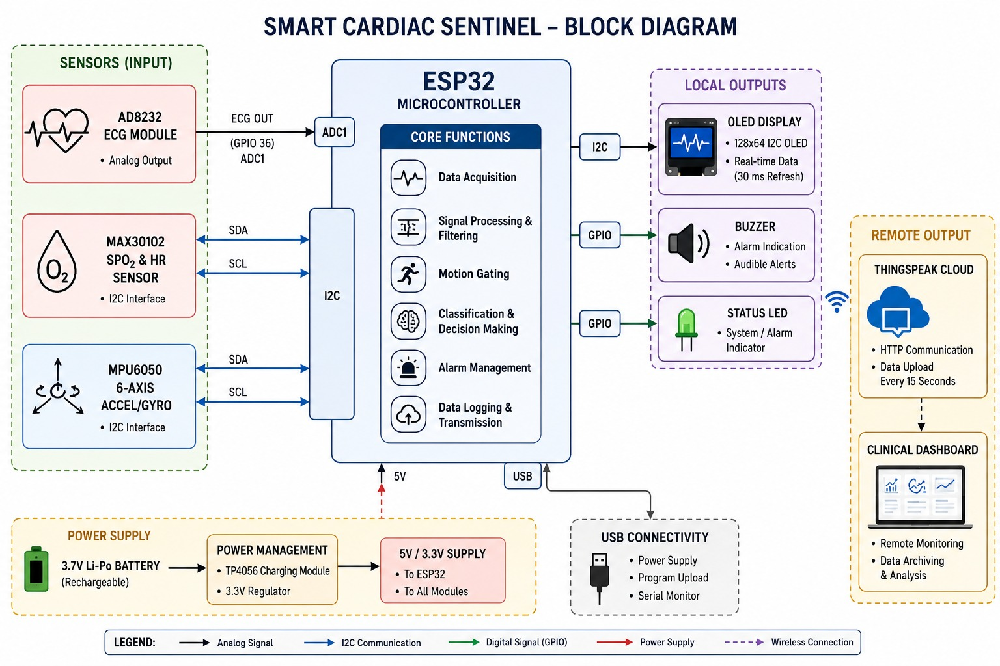
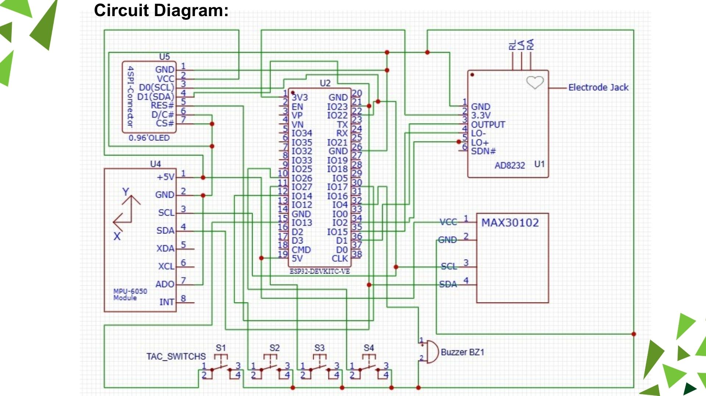
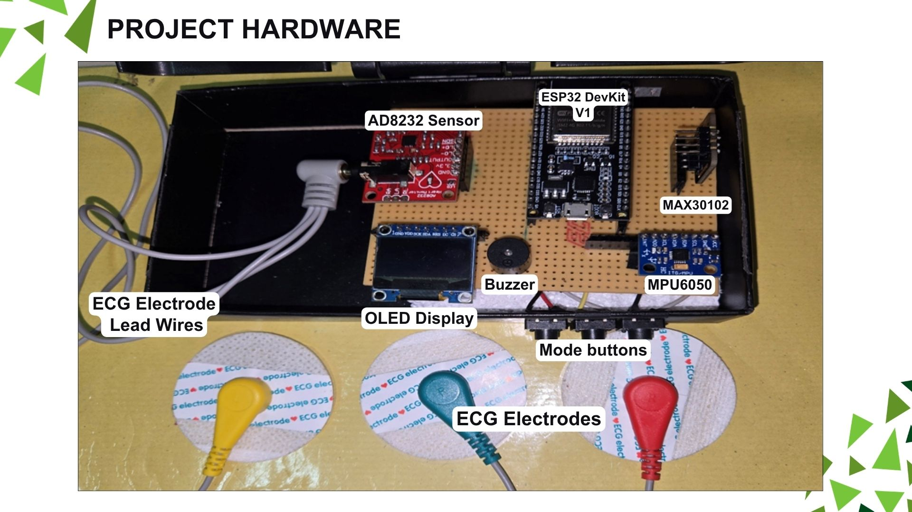

# ❤️ Smart Cardiac Sentinel

A context-aware wearable cardiac monitoring system that combines **ECG, SpO₂, and motion sensing** to provide reliable real-time health monitoring while minimizing false alarms using hybrid edge intelligence.

---

## 📌 Overview

Traditional ECG tests capture only a short snapshot of heart activity, often missing transient abnormalities. This project continuously monitors a patient's cardiac condition by combining multiple physiological parameters and intelligently filtering motion-induced noise before generating alerts.

---

## ✨ Features

* 📈 Real-time ECG monitoring using AD8232
* ❤️ Heart rate & SpO₂ monitoring with MAX30102
* 🚶 Motion-aware ECG analysis using MPU6050
* 🧠 Hybrid Rule-Based + TinyML decision logic
* ☁️ IoT dashboard using ThingSpeak
* 📱 Emergency notifications through n8n
* 🔔 Local buzzer alerts for abnormal conditions

---

## 🛠 Hardware Used

* ESP32 DevKit
* AD8232 ECG Sensor
* MAX30102 Pulse Oximeter
* MPU6050 Accelerometer & Gyroscope
* OLED Display
* Active Buzzer

---

## 🖥 Software & Tools

* Arduino IDE
* ESP32 Framework
* TinyML
* ThingSpeak
* n8n
* SPIFFS

---

## 📷 System Architecture

### Block Diagram



### Circuit Diagram



### Hardware Prototype



---

## 📂 Project Structure

```text
├── source_Code/
├── Report_Doc/
├── Project_Pic/
├── Readme/
├── SRM_Hackathon/
└── mini_project_ppt.pdf
```

---

## 🚀 Future Scope

* LoRaWAN connectivity for remote healthcare
* Improved TinyML models for enhanced diagnosis
* Mobile application for doctors and caregivers
* Long-term health trend analysis

---

## 👨‍💻 Team

## 👨‍💻 Team
- [@DevanadanK](https://github.com/devanadan2906)  Lead 🗿
- [@GokulV](https://github.com/gokuloverseeker) - ExperimentRat
- **Pushparaj V** - Paper Worker
- **Nithish M** - Analyser 

Department of Electrical and Electronics Engineering
